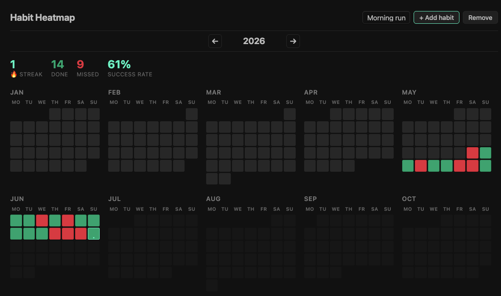

# Habit Heatmap Calendar 📅

Track your daily habits at a glance. A clean, heatmap-style calendar for Obsidian that helps you stay consistent — no notes required.



## ✨ Features

- **Multiple habits** — Add as many as you want and switch between them
- **One-click tracking** — Click any day to cycle through: `Not tracked → Done → Missed`
- **Year-at-a-glance** — Full year heatmap with month grids
- **Streak counter** — See your current streak, total done, missed, and success rate
- **Year navigation** — Browse past years or jump back to today
- **Zero clutter** — All data stored in a single `data.json`, no vault notes created

## 🚀 How to use

1. Click the **calendar icon** in the ribbon or run the command *"Open Habit Heatmap"*
2. Click **+ Add habit** and give it a name
3. Select your habit from the dropdown
4. Click any day to toggle its state:

| Click | State |
|-------|-------|
| 1st click | ✅ Done |
| 2nd click | ❌ Missed |
| 3rd click | ⬜ Not tracked |

The stats bar updates instantly so you always know where you stand.

## 💾 Data

All your habits and history live in:

```
.obsidian/plugins/habit-heatmap-calendar/data.json
```

It's plain JSON — easy to back up, sync, or edit.

## 📄 License

MIT
